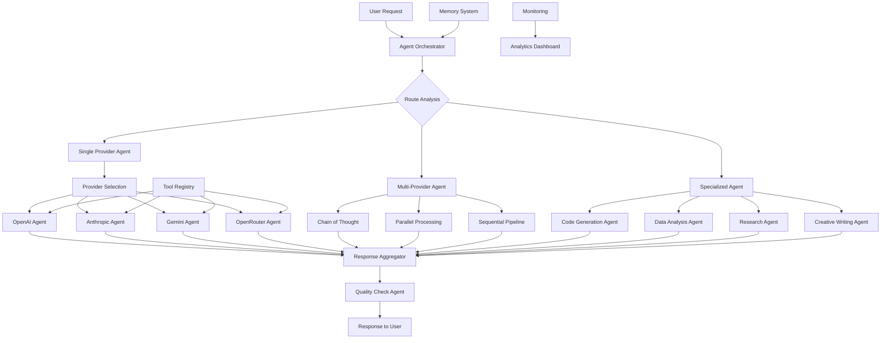

# 🤖 AnyGPT - Multi-LLM Agent Platform

## **🎯 Agent System Architecture**



## **🔧 Agent Types & Capabilities**

### **1. Provider-Specific Agents**
```typescript
interface ProviderAgent {
  type: 'openai' | 'anthropic' | 'gemini' | 'openrouter';
  capabilities: {
    reasoning: 'chain-of-thought' | 'zero-shot' | 'few-shot';
    tools: Tool[];
    memory: 'short-term' | 'long-term' | 'contextual';
    streaming: boolean;
    maxTokens: number;
  };
  config: {
    temperature: number;
    topP: number;
    presencePenalty: number;
    frequencyPenalty: number;
  };
}
```

### **2. Specialized Task Agents**
```
├── 🔍 Research Agent
│   ├── Web search capability
│   ├── Source validation
│   ├── Summary generation
│   └── Citation management
│
├── 💻 Code Agent
│   ├── Code generation (multiple languages)
│   ├── Code explanation
│   ├── Debugging assistance
│   ├── Code review
│   └── Documentation generation
│
├── 📊 Data Analysis Agent
│   ├── Data interpretation
│   ├── Chart generation
│   ├── Statistical analysis
│   ├── Pattern recognition
│   └── Report generation
│
├── ✍️ Creative Agent
│   ├── Content generation
│   ├── Style adaptation
│   ├── Tone adjustment
│   ├── SEO optimization
│   └── Plagiarism check
│
├── 🎯 Problem-Solving Agent
│   ├── Step-by-step reasoning
│   ├── Multiple solution paths
│   ├── Pros/cons analysis
│   └── Recommendation engine
│
└── 🔄 Workflow Agent
    ├── Task decomposition
    ├── Parallel execution
    ├── Result aggregation
    └── Progress tracking
```

### **3. Meta-Agents**
```
├── 🎭 Orchestrator Agent
│   ├── Routes requests to appropriate agents
│   ├── Manages agent collaboration
│   ├── Load balances between providers
│   └── Handles failover scenarios
│
├── 📝 Quality Assurance Agent
│   ├── Validates responses
│   ├── Checks for hallucinations
│   ├── Ensures factual accuracy
│   └── Rates response quality
│
├── 💾 Memory Agent
│   ├── Short-term context management
│   ├── Long-term knowledge storage
│   ├── User preference learning
│   └── Conversation summarization
│
└── 🛠️ Tool Manager Agent
    ├── Tool discovery & registration
    ├── Tool execution orchestration
    ├── Tool result validation
    └── Tool usage analytics
```

## **🔄 Agent Workflow Patterns**

### **Pattern 1: Sequential Chain**
```
User Request → Router Agent → Specialist Agent 1 → Specialist Agent 2 → Aggregator → Response
```

### **Pattern 2: Parallel Processing**
```
User Request → Router Agent
               ├── Agent 1 (Analysis)
               ├── Agent 2 (Research)
               └── Agent 3 (Creative)
               ↓
           Results Aggregator → Response
```

### **Pattern 3: Recursive Refinement**
```
User Request → Base Agent → Draft → Refinement Agent → Improved Draft → Final Agent → Response
```

### **Pattern 4: Multi-Provider Ensemble**
```
User Request → Query to OpenAI → Query to Anthropic → Query to Gemini → Vote/Combine → Response
```

## **🧩 Tool Integration System**

### **Available Tools Registry**
```typescript
interface AgentTool {
  id: string;
  name: string;
  description: string;
  category: 'search' | 'calculation' | 'data' | 'api' | 'file' | 'code';
  providerSupport: {
    openai: boolean;
    anthropic: boolean;
    gemini: boolean;
  };
  parameters: ToolParameter[];
  execute: (params: any) => Promise<ToolResult>;
  cost: number; // per execution
}
```

### **Tool Categories**
```
🔍 Search Tools:
├── Web Search (Serper, Google)
├── Academic Search
├── News Search
└── Image Search

📁 File Tools:
├── PDF Text Extraction
├── Image Analysis
├── Document Processing
└── File Conversion

💾 Data Tools:
├── Database Query
├── API Integration
├── Spreadsheet Analysis
└── Chart Generation

🧮 Calculation Tools:
├── Math Solver
├── Unit Converter
├── Currency Converter
└── Statistical Calculator

🔗 API Tools:
├── Weather API
├── Stock API
├── Translation API
└── Geolocation API

🔄 Workflow Tools:
├── Email Sender
├── Calendar Integration
├── Task Management
└── Notification System
```

## **🧠 Memory System Architecture**

### **Memory Types**
```
Short-term Memory (Conversation Context):
├── Last 50 messages
├── Current conversation state
├── Active tools in use
└── User preferences for session

Long-term Memory (Vector Database):
├── User preferences & habits
├── Past conversation summaries
├── Learned knowledge
└── Custom instructions

Episodic Memory:
├── Success/failure patterns
├── Tool usage effectiveness
├── Provider performance data
└── Response quality metrics

Semantic Memory:
├── Factual knowledge base
├── Domain expertise
├── Common patterns
└── Best practices
```

### **Memory Implementation**
```typescript
interface MemorySystem {
  // Short-term
  contextWindow: Message[];
  conversationState: {
    activeTopic: string;
    userMood: string;
    complexityLevel: 'simple' | 'detailed' | 'expert';
  };
  
  // Long-term
  vectorStore: {
    userEmbeddings: Vector[];
    conversationEmbeddings: Vector[];
    knowledgeEmbeddings: Vector[];
  };
  
  // Episodic
  experiences: {
    successfulPatterns: Pattern[];
    failedPatterns: Pattern[];
    optimalProviders: Record<string, string>;
  };
}
```

## **⚙️ Agent Configuration System**

### **Agent Profiles**
```yaml
agent_profiles:
  basic_chat:
    type: single-provider
    provider: openai
    model: gpt-4-turbo
    temperature: 0.7
    max_tokens: 2000
    tools: [web_search, calculator]
    memory: short-term
    
  research_assistant:
    type: multi-agent
    agents: [web_researcher, summarizer, fact_checker]
    workflow: parallel-then-aggregate
    quality_check: true
    sources_required: 3
    
  code_expert:
    type: specialized
    provider: openrouter
    model: claude-3-sonnet # Best for coding
    temperature: 0.2
    tools: [code_execution, syntax_checker, documentation]
    memory: long-term
    
  creative_writer:
    type: sequential-chain
    steps:
      - agent: idea_generator
        provider: anthropic
      - agent: outline_builder
        provider: gemini
      - agent: content_writer
        provider: openai
      - agent: editor
        provider: openai
```

### **Agent Selection Logic**
```typescript
function selectAgent(request: UserRequest): AgentConfig {
  // Analyze request
  const analysis = analyzeRequest(request);
  
  // Route based on criteria
  if (analysis.isComplex && analysis.requiresResearch) {
    return agentProfiles.research_assistant;
  }
  
  if (analysis.involvesCode) {
    return agentProfiles.code_expert;
  }
  
  if (analysis.isCreative) {
    return agentProfiles.creative_writer;
  }
  
  // Default to basic chat with provider preference
  return {
    ...agentProfiles.basic_chat,
    provider: getUserProviderPreference(request.userId)
  };
}
```

## **📊 Agent Performance Metrics**

### **Quality Metrics**
```
Response Quality:
├── Relevance Score (0-10)
├── Accuracy Score (0-10)
├── Completeness Score (0-10)
├── Clarity Score (0-10)
└── Helpfulness Score (0-10)

Efficiency Metrics:
├── Response Time (ms)
├── Token Usage Efficiency
├── Tool Execution Success Rate
└── Cost per Quality Point

Reliability Metrics:
├── Success Rate (%)
├── Error Rate (%)
├── Hallucination Rate (%)
└── Provider Fallback Rate (%)

User Satisfaction:
├── Explicit Feedback (thumbs up/down)
├── Implicit Feedback (engagement time)
├── Return Rate
└── Feature Usage Patterns
```

### **Agent A/B Testing**
```typescript
interface ABTest {
  testId: string;
  agents: {
    control: AgentConfig;
    variant: AgentConfig;
  };
  metrics: string[];
  targetUsers: UserSegment[];
  duration: number;
  successCriteria: {
    minImprovement: number;
    statisticalSignificance: number;
  };
}
```

## **🔐 Security & Safety Agents**

### **Safety Layers**
```
1. Input Validation Agent:
   ├── Malicious prompt detection
   ├── Prompt injection prevention
   ├── Content filtering
   └── Rate limiting enforcement

2. Output Safety Agent:
   ├── Toxicity detection
   ├── Fact-checking
   ├── Bias detection
   └── PII detection & redaction

3. Compliance Agent:
   ├── Regulatory compliance check
   ├── Terms of service enforcement
   ├── Usage policy enforcement
   └── Audit logging

4. Privacy Agent:
   ├── Data anonymization
   ├── Secure data handling
   ├── Encryption enforcement
   └── Data retention policy
```

## **🚀 Deployment Strategies**

### **Agent Deployment Pipeline**
```
1. Development:
   ├── Local agent testing
   ├── Mock tool integration
   └── Unit testing

2. Staging:
   ├── Integration testing
   ├── Performance benchmarking
   └── Safety evaluation

3. Canary Deployment:
   ├── 5% user traffic
   ├── Real-time monitoring
   ├── Automatic rollback on issues
   └── Gradual ramp-up

4. Production:
   ├── Full deployment
   ├── Continuous monitoring
   ├── Automated scaling
   └── Backup agents ready
```

### **Agent Versioning**
```yaml
agent_version: 1.2.3
components:
  orchestrator: 2.1.0
  memory_system: 1.5.0
  tool_registry: 3.0.1
  safety_layer: 1.0.0
providers:
  openai_adapter: 1.3.0
  anthropic_adapter: 1.2.0
  gemini_adapter: 1.1.0
  openrouter_adapter: 2.0.0
```

## **📈 Agent Improvement Loop**

### **Continuous Learning System**
```
1. Data Collection:
   ├── User interactions
   ├── Agent performance data
   ├── Tool usage patterns
   └── Error logs

2. Analysis:
   ├── Identify improvement areas
   ├── Detect patterns
   ├── A/B test results
   └── User feedback analysis

3. Training:
   ├── Fine-tune agent selection
   ├── Update prompt templates
   ├── Optimize tool usage
   └── Adjust provider weights

4. Deployment:
   ├── New agent versions
   ├── Updated configurations
   ├── Improved tools
   └── Enhanced safety measures

5. Monitoring:
   ├── Performance tracking
   ├── User satisfaction
   ├── Cost optimization
   └── Safety compliance
```

## **🎯 User Customization**

### **Custom Agent Creation**
```typescript
interface CustomAgentBuilder {
  // Choose base agent
  baseAgent: 'chat' | 'research' | 'code' | 'creative';
  
  // Configure providers
  providers: {
    primary: ProviderConfig;
    fallbacks: ProviderConfig[];
    loadBalancing: 'round-robin' | 'cost-based' | 'performance-based';
  };
  
  // Select tools
  tools: string[];
  
  // Configure behavior
  personality: {
    tone: 'formal' | 'casual' | 'friendly' | 'professional';
    verbosity: 'concise' | 'detailed' | 'thorough';
    creativity: 'low' | 'medium' | 'high';
  };
  
  // Memory settings
  memory: {
    contextLength: number;
    learnFromInteractions: boolean;
    storeConversations: boolean;
  };
  
  // Safety settings
  safety: {
    contentFilter: 'strict' | 'moderate' | 'lenient';
    factChecking: boolean;
    privacyMode: boolean;
  };
}
```

## **🔍 Monitoring & Debugging**

### **Agent Debug Dashboard**
```
Real-time Monitoring:
├── Active Agents
├── Request Queue
├── Provider Status
├── Tool Usage
└── Error Rates

Performance Metrics:
├── Response Times (p50, p95, p99)
├── Token Usage
├── Cost Tracking
├── Success Rates
└── User Satisfaction

Debug Tools:
├── Request/Response Logs
├── Agent Decision Trees
├── Tool Execution Traces
├── Memory State Inspection
└── Error Stack Traces

Alerting:
├── Performance Degradation
├── Error Rate Spike
├── Cost Thresholds
├── Safety Violations
└── Provider Outages
```

This agent system transforms AnyGPT from a simple chat interface into an **intelligent agent platform** capable of complex tasks, multi-step reasoning, and specialized problem-solving across all major LLM providers.